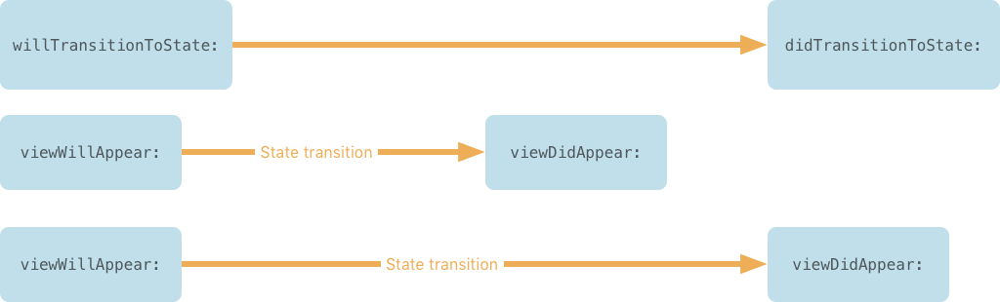

# StateViewController

When creating rich view controllers, a single view controller class is often tasked with managing the appearance of many other views, controls, and other user interface elements based on a state. That state, in turn, is often derived from multiple sources that need to be synchronized to correctly represent a single reliable state. Usually the end result is known as the *Massive View Controller* problem, often solved by attempts to abandon the [MVC](https://developer.apple.com/library/archive/documentation/General/Conceptual/DevPedia-CocoaCore/MVC.html) pattern, the primary design pattern in UIKit. While other patterns, such as [MVVM](https://en.wikipedia.org/wiki/Model–view–viewmodel) or [MVP](https://en.wikipedia.org/wiki/Model–view–presenter), can solve some issues, going with the grain rather than against makes interacting with UIKit more accomodating. 

This repository houses a `UIViewController` subclass, enabling modularization and decoupling of view controllers, reducing the size of individual view controllers substantially, without the need for abandoning MVC as a design pattern.


## Requirements

* iOS 8.0+
* tvOS 9.0+

## Overview
`StateViewController` is a container view controller that presents one or more view controllers for any given state that you define, such as `loading`, `list`, or `editing`. It manages the appearance cycles of each child view controller, making sure that the view life cycle of the child view controllers are intact and in order, notifying you about state transitions and which child view controllers are about to appear or disappear from the view hierarchy. This allos you to compose multiple view controllers and re-use them throughout the app. The state view controller also provides extensive support for animating the transition between states.

The state view controller helps you manage child view controllers representing different states. In the example application included in this project the state view controller switches between two view controllers. Firstly, it displays and animates the transition of an activity indicator view controller while a network call is being performed. Once the network call is successfully completed it transitions into a state displaying a table view with the loaded content.


<p align="center">
    
</p>
*StateViewController coordinates state transition with view controller lifecycles*


## Documentation

The source code documentation can be found [here](https://formbound.github.io/StateViewController/).

## Installation
This module is available via [Carthage](https://github.com/Carthage/Carthage). Modify your [Cartfile](https://github.com/Carthage/Carthage#quick-start) to include `StateViewController`:

```
github "formbound/StateViewController"
```

## Usage

```swift
import StateViewController
```

### Subclassing StateViewController

To use `StateViewController` you must override it. The class is generic with a subtype of `State` which must conform to `Equatable`. The state type can be designed to house the actual model data required by your view controller, but that's an optional design decision. For instance, you can create a state that simply determines an abstract state:

```swift
enum MyState: Equatable {
    case loading
    case ready
    case error
}
```

Or, you can define a state which in itself contains model data:
```swift
enum MyState: Equatable {
    case loading
    case ready(MyModel)
    case error(Error)
}
```

Once you have a state, create a subclass of `StateViewController`.

```swift
class MyStateViewController: StateViewController<MyState>
```

Each time `StateViewController` is about to appear on screen it will call its `loadAppearanceState()` method. This method returns a state which should be ready for display as soon as the view controller is on screen. Override this method to determine what state is appropriate to display immediately, depending on cached data or the contents of your database.

```swift
override func loadAppearanceState() -> MyState {
    if let myModel = MyCache.cachedModel {
        return .ready(myModel)
    } else {
        return .loading
    }
}
```

Each state can be represented by zero or more view controllers. To provide which view controllers are visible for what state, override `children(for:)`.

```swift
override func children(for state: MyState) -> [UIViewController] {
    switch state {
        case .loading:
            return [ActivityIndicatorViewController()]
        case .ready:
            return [myTableViewController]
        case .error:
            return [ErrorViewController()]
    }
}
```

You receive callbacks for when a state transition will begin, and when it has finished.
`willTransition(to:animated:)` is a good place to prepare your child view controllers for appearance.

```swift
override func willTransition(to nextState: MyState, animated: Bool) {
    switch nextState {
        case .ready(let model):
            navigationItem.setRightBarButton(myBarButtonItem, animated: animated)
            myTableViewController.setRows(model.objects)
        default:
            navigationItem.setRightBarButton(nil, animated: animated)
    }
}
```

When `didTransition(from:animated:)` is called, a state transition has finished successfully. This is a good time to invoke other methods which in turn will trigger another state transition.

```swift
override func didTransition(from previousState: State?, animated: Bool) {
    switch currentState {
        case .loading:
            fetchData { model in
                self.setNeedsTransition(to: .ready(model), animated: true)
            }
        defualt:
            break
    }
}
```

Your `StateViewController` is now ready, and will switch between view controllers depending on state. Using `setNeedsTransition(:to:animated:)` you can transition between various states during the life cycle of your state view controller subclass.

Multiple other callbacks are available for determining when a child view controller is appearing or disappearing. Please reference the documentation or the [Example](/Example).


### Providing transitions between child view controllers

Child view controllers of `StateViewController` conforming to the [`StateViewControllerTransitioning`](Sources/StateViewController/StateViewControllerTransitioning.swift) protocol can individually control their own transition. The available methods provide funtionality for:

- Specifying duration and delayed start of an animated transition
- Preparing the view controller for presentation
- Performing animations along side an animated transition
- Performing operations after a transition


## Contribute

Please feel welcome contributing to **StateViewController**, check the ``LICENSE`` file for more info.


## Credits

David Ask